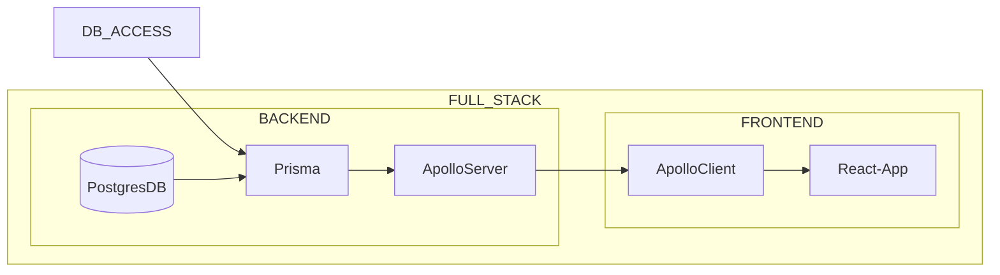
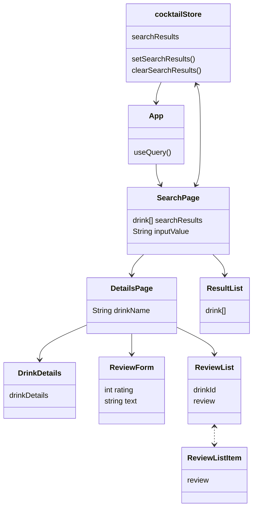

# Drinks

## Project description

Share your drink recipes and review others!
Drinks is a full stack app for viewing and reviewing drink recipes!
It is built with modern web technologies like React, Typescript, Tailwind and GraphQL.

## Setup dev environment

- Clone the repo
- Run `npm install` in the root directory to install dependencies for the frontend and backend

### Backend

- Spin up a postgres database
  - Mac
    - I use [Postgres.app](https://postgresapp.com/) to host my database and [Postico](https://eggerapps.at/postico/) to interact with it
    - You can also use [Homebrew](https://formulae.brew.sh/formula/postgresql)
    - Or [Docker](https://hub.docker.com/_/postgres)
- Create a `.env` file in the `/server/prisma` directory
- Add the database url to the `.env` file
  - `DATABASE_URL="postgresql://<username>:<password>@<host>:<port>/<database>"`
- Run `npm prisma:reset` in the `/server` directory to create the database schema and seed it with mock data
- Your backend is now ready to go!

### Update database schema

- Run `npx prisma migrate dev` in the `/server` directory to create the new database schema

### Generating seed data

To generate our seed data we use the [TheCocktailDB](https://www.thecocktaildb.com/api.php) API.

Ingredients data was downloaded from [TheCocktailDB]( www.thecocktaildb.com/api/json/v1/1/list.php?i=list) and manually cleaned and prepared for use in `server/src/prisma/seed.ts`.

All drinks data was downloaded from a [Kaggle dataset](https://www.kaggle.com/datasets/ai-first/cocktail-ingredients/).
The data was manually cleaned,
then converted to JSON using `server/src/lib/csvToJSON.ts`.
Furthermore it was cleaned and prepared with `server/src/lib/createDrinksSeed.ts`.
These programs can be run with `npm run run:drinksToJSON` and `npm run run:drinksToSeed` respectively within the `server/` folder.

## Scripts

- `npm run dev` runs the app and server in development mode
- `npm run start` runs the app and server in production mode
- `npm run test` runs tests for the app and server
- Prefix `start` with `server:` to run only the server
- Prefix all commands with `app:` to run only the app

More specific commands you find by checking out the subrepos `/app` and `/server`

## File structure

- `app/` contains web app code
  - `index.html` configure metadata here
    - is technically the main entry point for the application
  - `public/` contains public assets
  - `src/` contains the main code for the application
    - `assets/` contains private assets like images and fonts
    - `components/` contains components our team has written
      - `ui/` contains shadcn/ui components
    - `hooks/` contains our custom hooks
    - `pages/` define separate pages in the application
      - Importantly have the responsibility of data handling and conditional rendering
    - `server/` contains code related to fetching data from the server
    - `lib/` contains different utilities
      - Basically "etc." but for code reused throughout the application
    - `App.tsx` is where we apply our app layout
    - `global.css` defines css variables and resets default styling
    - `main.tsx` is the main entry point for our application
      - Here providers, routing and styles are added to the application
    - `router.tsx` is where we handle routing
- `data/` contains static mock data
- `server/` contains server code
  - `prisma/`
    - `schema.prisma` defines the database schema
  - `src/` contains the main code for the server
    - `index.ts` is the main entry point for the server
      - Here we define the server and connect it to the database

## Tech-stack

### React

Javascript frameworks are a staple of modern web development and React is our choice for its popularity and ease of use.

### Typescript

Typescript is essential for our workflow as it provides us with type safety and a better development experience (DX).

### Vite

Vite is our required frontend build tool. No configuration is required outside of whats included in the repo.

### React Router

React Router allows us to employ URL path routing in our Single Page Application (SPA)

#### Implementation

- All pages are wrapped within `<App />` which contains layout elements like a universal header
- Search Page (/): Users can search for and are presented with a myriad of cocktail recipes
- Details Page (/cocktail/:cocktailId): Displays information specific to the cocktailId parameter
- Error Page (*): Displays if a routing error occurs, for example navigating to an undefined page url

```jsx
const rootPath = import.meta.env.BASE_URL
export const appRouter = createBrowserRouter([
  {
    path: rootPath,
    element: <App />,
    errorElement: <ErrorPage />,
    children: [
      {
        path: rootPath,
        element: <SearchPage />,
      },
      {
        path: "cocktail/:cocktailId",
        element: <DetailsPage />,
        errorElement: <ErrorPage />,
      },
    ],
  },
  ]);
```

### Tailwind

Tailwind is our choice for in-line styling.
It is popular for good reasons.
The development experience (DX) it provides lets us focus on making a good website without having to bother with the intricacies of plain css.

### shadcn/ui

Shadcn/ui or Shadui for short is a collection of re-usable components that you can copy and paste into your apps.
This is not a component library in the sense that it is not a dependency.

We use shadcn/ui components as our base and build on top of the sensible defaults it provides.

### Zustand

Zustand is our choice of state management library.
It is a simple and lightweight library that provides us with uncomplicated global state management.
A choice like Redux would be overkill for our use case.

### Testing with Cypress

Cypress is our choice of testing library for its ease of use and its excellent E2E testing environment.
To open the Cypress testing app run `npm run cypress:open` and it will automatically open.
From there on you can choose whether to run component or end-to-end (E2E) tests.

#### Component testing

We do not write custom tests the shadcn/ui components as it is a stable "library" and we are not tinkering with its primitives.

#### End-to-end testing

Our most important tests are our e2e tests that ensures the app works as intended for our users.

### Linting

ESlint is used for linting. Our configs lie in .eslintrc.cjs. To manually test the linting of the project run the command

`npm run lint`

### Formatting (Prettier)

Prettier is our choice of formatter.
To manually format the project run

`npm run format`

in the app directory.\
Our team prefers to use the VSCode Prettier extension with the "Format on save" option enabled.
That way it is practically impossible to push unformatted code.

`.prettierrc` contains our configurations so everyone has the same formatting rules.
These are set to the defaults with the exception of enabling plugins.

#### Plugins

The plugins we use are:

- "prettier-plugin-organize-imports"
- "prettier-plugin-tailwindcss"

These sort and clean up our imports and tailwind classes so to avoid meaningless merge conflicts.

### GraphQL

GraphQL is an effective and environmentally friendly way to query data from a server.
We recognize that GraphQL might be overkill for our use case as we have a fairly simple relational database.
However, we want to use GraphQL to learn. (And it is a requirement for the course 😉)
A realistic application would either have a more complex database with more data or use a graph database like Neo4j to justify the use of GraphQL.
Personally, I would use TRPC as our frontend and backend are written in Typescript,
but GraphQL is more flexible as it is language agnostic.
It is also more stable as it is a more mature technology with a large community.

### Apollo server and client

Apollo is the easiest way to implement GraphQL in our stack.
It is important not to overcomplicate our stack with too many libraries and Apollo is a good choice for that reason.

Apollo server is used to implement our GraphQL server.

Apollo client is used fetch data from our GraphQL server in the frontend.

### Prisma

Prisma makes it incredibly easy to implement a database in our stack.
It gives us type safety when defining our GraphQL resolvers and a simple way to interact with our database.

### PostgresQL

PostgresQL is all we need for our database.
We could have chosen to make a project using a graph database,
but for that choice to make sense it would require us to make for example a social media app with a lot of relations, like Twitter(X) or Facebook.

## Code style

### Commit messages

We follow the conventional commits specifications described in <https://www.conventionalcommits.org/en/v1.0.0/>

[more concise and web oriented document](https://gist.github.com/qoomon/5dfcdf8eec66a051ecd85625518cfd13)

We also use the conventional commits VSCode extension for ease of use

#### Template

```
<type>[optional scope]: <description>

[optional body]

[optional footer(s)]
```

## Diagrams

### Application architecture



### Component hierarchy


